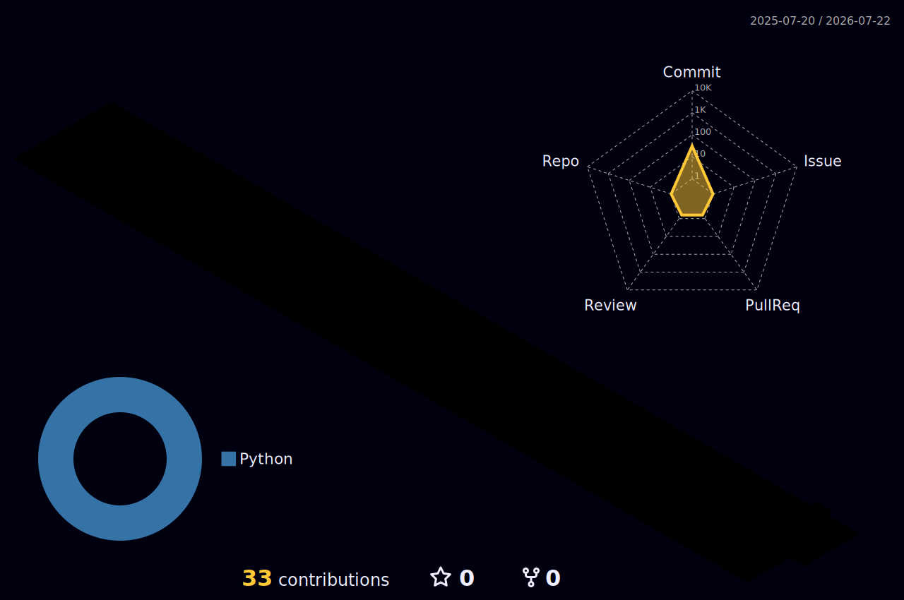

<div align="center">


<!-- 👇 füg hier dein sakura-gif ein (schön mittig, ca. 400px breit) -->


<br>


</div>

<br>

<div align="center">

<!-- 👇 füg hier dein pixel-laptop-gif ein (klein, ca. 120px) -->

</div>

```bash
rajan@dev:~$ cat about.txt
```

- 🎓 CS student at TH Köln, Campus Gummersbach
- 💻 Full-stack developer — Next.js, TypeScript, Python, Kotlin
- 🛒 Sole IT lead for a mid-sized commerce business, from infrastructure to the internal product platform
- 🌐 Freelance web developer — building and maintaining production websites for clients across different industries
- 🤖 Designing and running automated backend systems that handle real-time events, payments, and operations at scale
- 🎮 Founder of my own Esports organization, building the tooling that runs it end-to-end
- 💳 Built a self-hosted payment & e-commerce system
- 🏠 Deep into homelab & self-hosting — virtualization, networking, running my own infrastructure
- 🧠 Heavy daily use of AI tools across development, debugging, and data analysis

<br>

```bash
rajan@dev:~$ ls ./projects
```

- 🛒 **B2B Commerce Platform** — a large product catalog platform (thousands of SKUs) built end-to-end for a wholesale business: search, admin tooling, and document generation
- 🌐 **Client Websites** — multiple freelance web projects across different industries, from marketing sites to subscription-based platforms
- 🤖 **Automated Operations Systems** — several backend systems for community & team management: scheduling, verification flows, and dispute handling, running for real active user bases
- 💳 **SwoooshPay** — a self-built payment gateway & e-commerce system supporting multiple payment methods
- 🎮 **Miracle Esports** — an Esports organization I founded and run, with fully custom tooling behind it
- 🏠 **Homelab** — self-hosted infrastructure project: virtualization, networking, and service hosting from the ground up

<div align="center">
<!-- 👇 füg hier dein hochgeladenes projects-Bild ein -->
</div>

<br>

### 🛠️ Tech Stack

<div align="center">

</div>

<br>

### 📊 Stats

<div align="center">


</div>

<div align="center">

</div>

<br>

### 🐍 Contribution Snake

<div align="center">
<picture>
  <source media="(prefers-color-scheme: dark)" srcset="https://raw.githubusercontent.com/Heaven-Rajan/Heaven-Rajan/output/github-contribution-grid-snake-dark.svg" />
  <source media="(prefers-color-scheme: light)" srcset="https://raw.githubusercontent.com/Heaven-Rajan/Heaven-Rajan/output/github-contribution-grid-snake.svg" />
  
</picture>
</div>

<br>

### 🧊 3D Contribution Calendar

<div align="center">

</div>

<br>

### 📈 Metrics Dashboard

<div align="center">

</div>

<br>

### 📫 Get in Touch

<div align="center">

[](mailto:letscontactheaven@gmail.com)
[](https://github.com/Heaven-Rajan)

</div>


</div>
